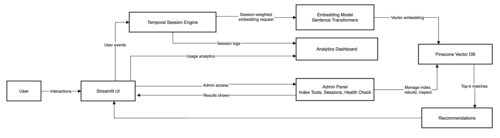
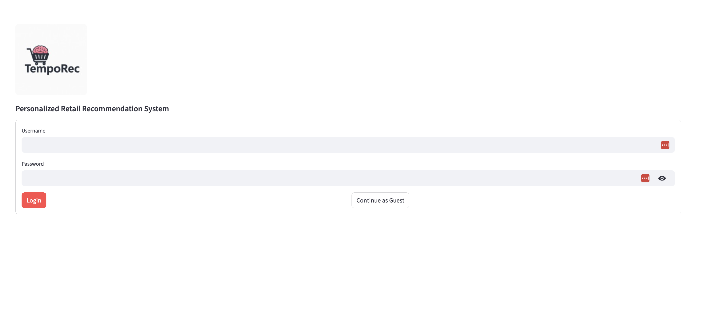
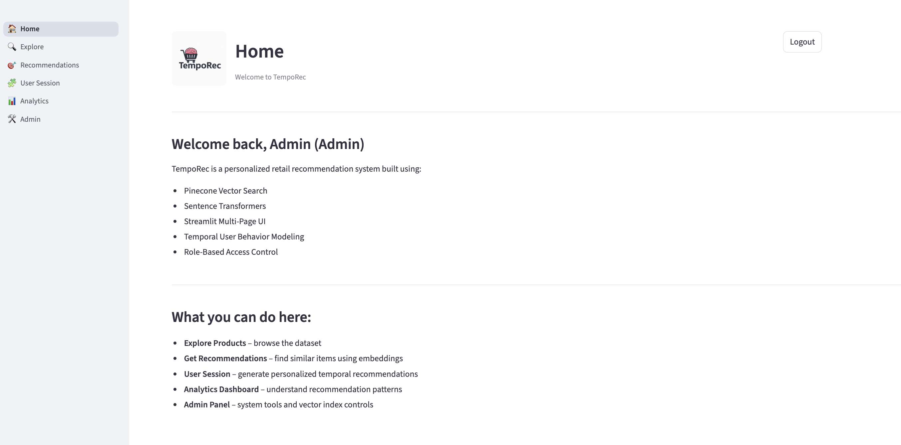
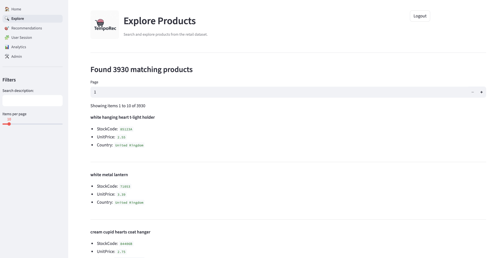
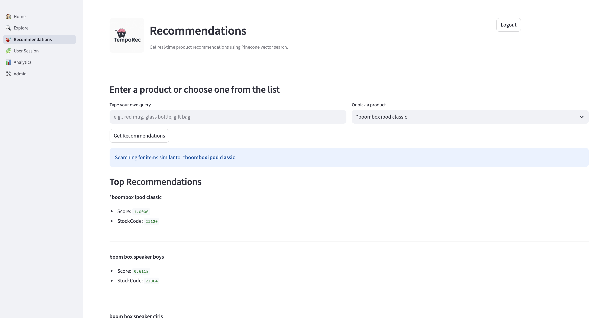
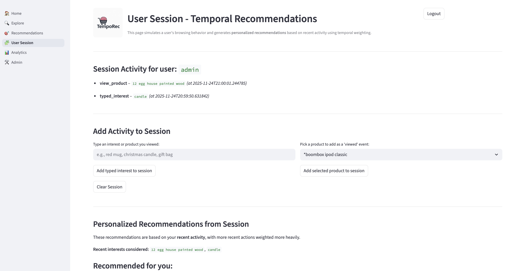
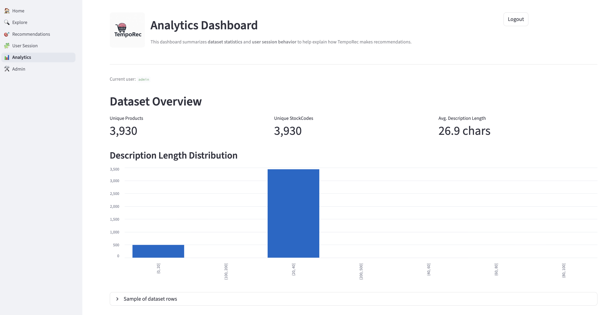
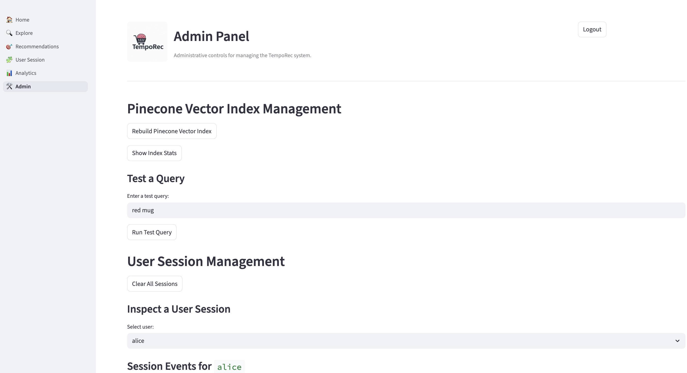

# TempoRec — AI-Powered Retail Recommendation System


TempoRec is an end-to-end **vector-based recommendation system** built using:

- **Streamlit** (multi-page UI)
- **Pinecone** vector search
- **Sentence Transformers** for embeddings
- **Temporal user session modeling**
- **Role-based authentication**
- **Admin panel** and analytics dashboard

This project is built as part of the **MSDS 715 — Data Mining & Big Data** course.

---
## System Architecture

---
## Features

### Authentication
- Secure login UI (Admin & User)
- Guest access mode
- Session-based login state

### Home Page
- Personalized welcome
- Quick overview of system features

### Explore Products
- Browse Online Retail Dataset
- Search, filtering, pagination
- Clean product list display

### Recommendations
- Query-based semantic recommendations
- Pinecone vector search
- Model: Sentence Transformers

### Temporal User Sessions
- Tracks product views and typed interests
- Temporal embedding calculation: `user_embedding = 0.7 * last_event + 0.2 * second_last_event + 0.1 * avg(older_events)`
- Personalized recommendations based on session activity

### Analytics Dashboard
- Dataset-level statistics
- Session analytics per user
- Event timeline visualization
- Top interests & counts

### 🛠 Admin Panel
- Rebuild Pinecone index
- Test query against vector DB
- View & clear session data
- Health check (Model, Pinecone, Query)
- Masked environment variables

---
## Screenshots

### Login Page


### Home Page


### Explore Products


### Recommendations


### User Session


### Analytics


### Admin Panel


---
## 🔧 Installation

### 1. Clone repository
```bash
git clone https://github.com/<your-username>/tempo-rec.git
cd tempo-rec
```
### 2. Create virtual environment
```bash
python3 -m venv venv
source venv/bin/activate
```
### 3. Install dependencies
```bash
pip install -r requirements.txt
```

### 4. Environment Variables
Create `.env` file:
```
PINECONE_API_KEY=your-api-key
PINECONE_INDEX_NAME=tempo-rec
PINECONE_ENVIRONMENT=us-east-1
```

### 5. Run the Application
```bash
streamlit run src/app.py
```

## Future Enhancements
- Add product images
- Improve UI to card-based layout
- Add hybrid keyword + vector search
- Add authentication backend (Cognito, Firebase)
- Deploy using CI/CD pipeline to AWS

## Dataset
Dataset derived from:
`D. Chen. "Online Retail," UCI Machine Learning Repository, 2015. [Online]. Available: https://doi.org/10.24432/C5BW33.`

